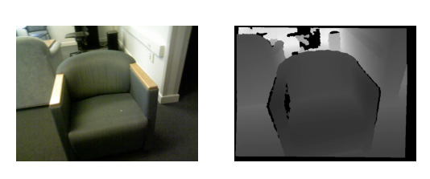

# Introduction

## What this project is about?
The Machine Perception project is about learning to work with more unusual data: depth images, point clouds, EEG and EMG, as well as to operate on tasks in the fields of robotics using Robot Operating System.

## Schedule
+ Topic 1 - Introduction and RGB-D Data (K. Młodzikowski) 
+ Topic 2 - Point Clouds and ROS (D. Sójka) 
+ Topic 3 - EMG (K. Młodzikowski)
+ Topic 4 - SLAM (D. Sójka)
+ Topic 5 - **Projects assignment**

In the 5th class, you will be assigned into pairs and will choose a project topic. Then, for all the next classes, you will come according to the proposed schedule (in pairs) to talk about your project advancements.

For the last classes, you will prepare a presentation of your project and present it in front of the whole group.

## Passing requirements

To pass, you have to work on a project, report your progress verbally every week and present its results in front of the whole group at the end of the semester.

There will be a **total of 30 points** to get:
+ 15 p. for implementation:
  + 5 p. for code review
  + 10 p. for fulfilling the project's requirements
+ 5 p. for systematic work
+ 10 p. for the presentation:
  + 6 p. for presenting the project
  + 4 p. for the questions after it

To pass you need to get **at least 15 points**.

## Projects
The projects will be about using deep learning with the data and tools that you'll learn about in the 4 first classes. You will be provided with datasets and a specific problem to solve. The specific subjects will be presented in the 5th class.

## FAQ

1. Can there be a group of 3 (or 4, 5 and so on...)?

        No. (Only if there is an odd number of students, there will be one group containing 3 people.)
        
2. Do both people need to come every week to report the project's advancements? 

        Generally yes, but in special circumstances, the presence of only one person from the pair is acceptable. 

3. We came up with our own project idea, can we do it instead of one of the proposed ones?

        Yes, if the teacher finds it suitable to be a project. Please have it prepared for the 5th class (or earlier).

# RGB-D Data

> **_IMPORTANT:_**  Before proceeding to the rest of this instrucion, start downloading this file: https://chmura.put.poznan.pl/s/SnJSLZYvvxX6gaI


An RGB-D image is actually a pair of images, one usual RGB image, and one corresponding depth image.

A [depth image][1] is an image or image channel that contains information relating to the distance of the surfaces of scene objects from a viewpoint. Usually, the further away from the camera the surface is, the brighter it is on the image. It is this way because the image stores the distance - the higher the distance, the brighter the image.

## Example data


[source][1]

## How to load and preview depth images
We are going to use Python to load and preview depth data. 

1. Open the chosen IDE and create a new project.
Clone this project from GitHub: https://github.com/isl-org/redwood-3dscan and run
    ```python
    import redwood_3dscan as rws

    rws.download_rgbd("00033")
    ```
2. Extract the downloaded file.
3. Modify the script so it matches your paths and run:
   ```python
    import matplotlib.pyplot as plt
    from PIL import Image
    import numpy as np

    depth_path = "<YOUR PATH>/data/rgbd/00033/depth/0000309-000010277729.png"
    rgb_path = "<YOUR PATH>/data/rgbd/00033/rgb/0000309-000010322928.jpg"

    depth = np.array(Image.open(depth_path))
    rgb = np.array(Image.open(rgb_path))

    fig, axs = plt.subplots(1, 2)

    axs[0].imshow(rgb)
    axs[1].imshow(depth)
    plt.show()
   ```

   **TIP**: the axes can be hidden using 
   ```python
    axs[0].axis('off')
    axs[1].axis('off')
   ```

   **TIP**: the depth image can be displayed in grayscale:
   ```python
    axs[1].imshow(depth, cmap='gray')
   ```

    The result should look like this:
    
    

As you can see, the real-world data is not so perfect. What are the black artifacts on the depth image? [Read how a depth camera works](https://en.wikipedia.org/wiki/Range_imaging).

## Depth image processing in deep learning

When loading an RGB (or grayscale) image for deep learning processes, you usually normalize and scale it. 

But how to normalize depth image? Because it is usually stored as int16 values, we can divide the whole image by the max value of this type (65535).

A greater problem occurs when we want to scale the image. Try scaling down the depth image ([for example using the PIL library and trying different resample methods](https://pillow.readthedocs.io/en/stable/reference/Image.html#PIL.Image.Image.resize)). Zoom to the edges of the chair. What are the values there? 

We have to use the NEAREST method, otherwise, there are depth values, that never were there in the first place.

# DIY Task 1
Download the dataset from (you should have downloaded it earlier, so it is probably already on your PC): https://chmura.put.poznan.pl/s/SnJSLZYvvxX6gaI

Prepare simple classification CNN (you can choose the framework, although [PyTorch](https://pytorch.org/) is suggested) using only the depth images. Separate the dataset to train and validation subsets.

Remember to augment the data (search for depth data augmentation methods).

# DIY Task 2

If you have finished the first task, report to the teacher. You will receive a depth camera, your task is to run it and preview the image on your computer.


[1]: <https://en.wikipedia.org/wiki/Depth_map> "Depth image on wikipedia"

---
<sub>Author: Kamil Młodzikowski</sub>