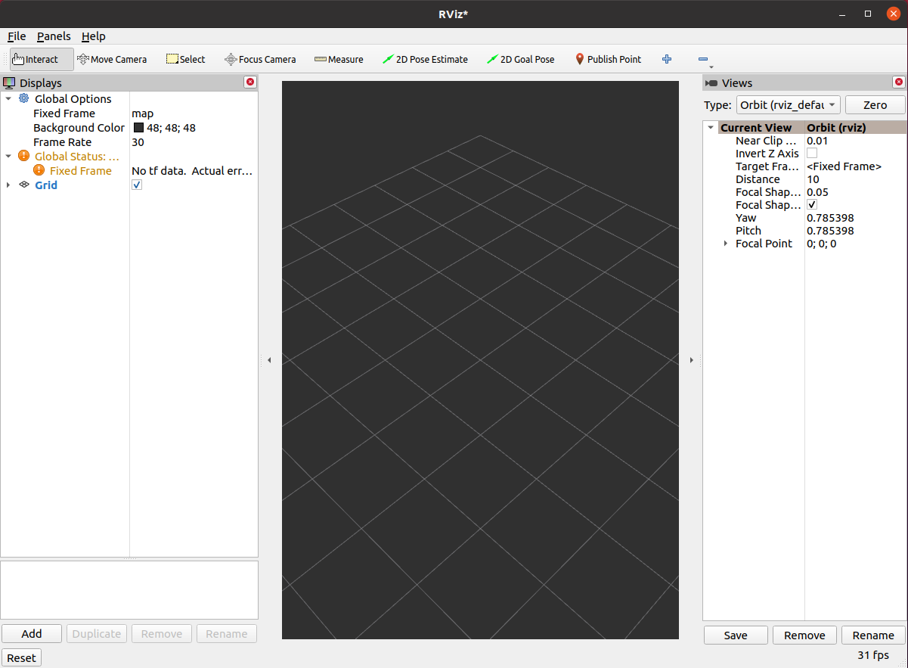
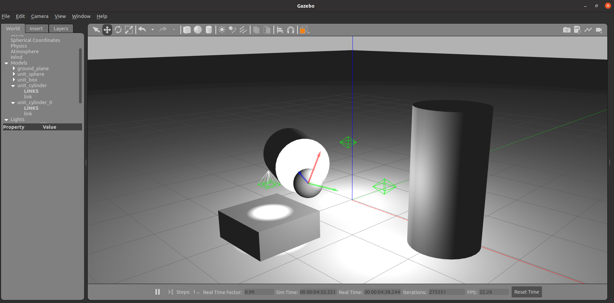
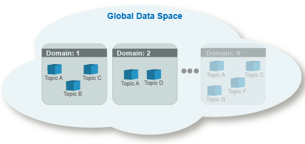
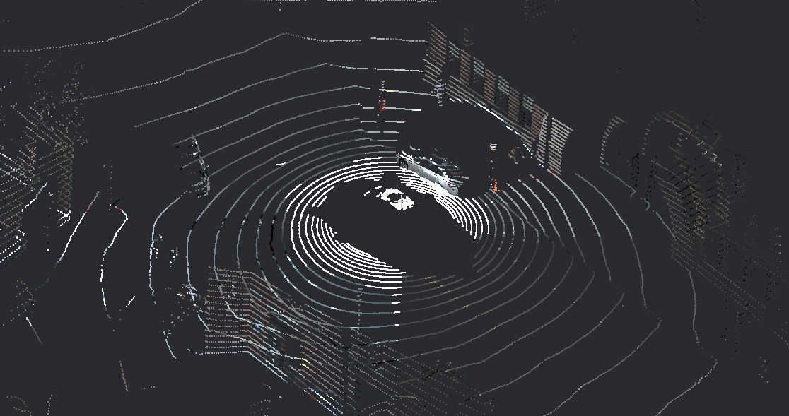
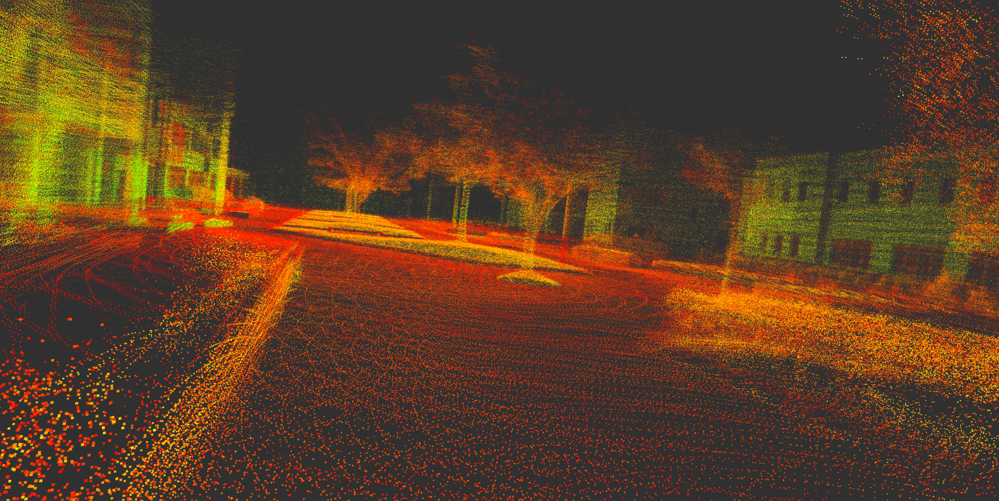

# Goals of the Class
In this class, you will learn the fundamentals and capabilities of ROS2 (Robot Operating System 2) by performing 2D SLAM (Simultaneous Localization and Mapping) and AMCL (Adaptive Monte Carlo Localization) using a simulated Turtlebot3 robot. Moreover, you will map the real 3D environment using data recorded from 3D LIDAR sensor. You will:

- Generate a 2D map of the robot’s environment using LIDAR data.
- Enable the robot to navigate autonomously within this known map.
- Explore how tweaking system parameters affects the performance of SLAM and AMCL algorithms.
- Extend your skills to 3D localization by creating a 3D map using a laser scanner and the lidarslam package.

# Before You Begin
To complete the exercises, you’ll need two Docker images: `arm/lab03` (for 2D SLAM and navigation) and `arm/lab06` (for 3D SLAM). These images contain pre-configured ROS2 environments with all required tools and dependencies.

## Check and Download Docker Images
Verify if the images are already on your computer:

```bash
docker images
```
Look for `arm/lab03` and `arm/lab06` in the output.

If they’re missing, download them:

For `arm/lab03`:
```bash
wget --content-disposition --no-check-certificate https://chmura.put.poznan.pl/s/pszNFePmGXxu1XX/download
```
For `arm/lab06`:
```bash
wget --content-disposition --no-check-certificate https://chmura.put.poznan.pl/s/B1td9ifRL1S0js9/download
```

Load the downloaded .tar.gz files into Docker:

```bash
docker load < path/to/file.tar.gz
```

# ROS2 Introduction / Recap

<p align="center">

</p>

The Robot Operating System (ROS) is a set of development libraries and tools for building robotic applications. ROS offers open-source tools ranging from sensor and robot controllers to advanced algorithms. Dedicated for advanced research projects, ROS1 could not be utilized for industrial applications. It was limited by weaknesses related to message access security and the lack of adaptation to the requirements of real-time systems. The second generation, ROS2, was redesigned to meet these challenges. The differences between the versions are described in [article](http://design.ros2.org/articles/changes.html). The first distribution of ROS2 came out in late 2017, _Ardent Apalone_, which significantly extends the functionality of ROS1. We will use one of the latest stable versions, [Humble Hawksbill](https://docs.ros.org/en/rolling/Releases.html). 

## Key ROS2 [Concepts](https://docs.ros.org/en/humble/Concepts.html#graph-concepts)

<!-- 🐢 processing based on independent modules ([graph concept](https://docs.ros.org/en/humble/Concepts.html#graph-concepts) - nodes. _nodes_),

🐢 communication through publishing and subscribing (concept of _publisher/subscriber_),

🐢 communication with feedback through services or actions (_services_, _actions_),

🐢 language-neutrality (any programming language can be integrated, _ROS client library_, _actions_). [_ROS client library_](https://docs.ros.org/en/humble/Concepts.html#client-libraries). -->

Here’s a breakdown of essential terms:

- **Nodes**: Small, independent programs that perform specific tasks (e.g., reading a sensor or moving a motor). Nodes communicate within a **ROS graph**, a network showing how they exchange data.
- **Topics**: Channels where nodes send and receive data using a publish/subscribe model. For example, a node might publish a robot’s position to the `/robot/position` topic, while another subscribes to display it.
- **Messages**: Structured data sent over topics, defined in `.msg` files (e.g., `geometry_msgs/msg/Twist` for velocity commands).
- **Services and Actions**: Ways for nodes to request data or trigger tasks with feedback, unlike the one-way communication of topics.
- **Discovery**: The automatic process where nodes find and connect to each other on the network.

<p align="center">

</p>

### ROS2 Environment (_Workspace_)

A ROS environment is the place where packages are stored, e.g. for a particular robot. There can be many different environments on one computer (e.g. _ros2_robotA_ws_, _ros2_robotB_ws_). A typical workspace looks like this:

```text
ros2_ws
├── build/    # Temporary files for building packages
├── install/  # Compiled packages ready to use
├── log/      # Build process logs
└── src/      # Your source code and packages
```

#### Building the Workspace
Use the [`colcon`](https://colcon.readthedocs.io/en/released/) tool to build the workspace:

```bash
cd ros2_ws
colcon build
```

To build a specific package:

```bash
colcon build --packages-select package_name
```

#### Activating the Workspace
After building, “source” the environment to access your packages in the terminal:

```bash
source install/setup.bash
```

> **Note**: Run this command in every new terminal session to work with your workspace.

### Packages
A package is a modular unit containing nodes, libraries, and configuration files. For example, a Python package might look like:
```text
my_package/
├── my_package/     # Nodes and scripts
├── setup.py        # Installation instructions
├── setup.cfg       # Executable details
├── package.xml     # Package info and dependencies
└── test/           # Automated tests
```

The organization of packages is done by using [`ament`](http://design.ros2.org/articles/ament.html), an evolution of [`catkin`](https://www.google.com/url?sa=t&rct=j&q=&esrc=s&source=web&cd=&ved=2ahUKEwi3t9bii7b7AhWSw4sKHXGFCvoQFnoECBQQAQ&url=http%3A%2F%2Fwiki.ros.org%2Fcatkin&usg=AOvVaw0vs2wEMzUY0BPSzVhnvG6P) known from ROS1. With this tool, packages are structured.

Create a package with:
- C++:
```bash
ros2 pkg create --build-type ament_cmake package_name
```

- Python:
```bash
ros2 pkg create --build-type ament_python package_name
```

Add dependencies using `--dependencies`, e.g., `--dependencies rclpy sensor_msgs`.

#### Package Dependencies Management

A tool that significantly improves the work of the ROS developer is [`rosdep`](https://docs.ros.org/en/foxy/Tutorials/Intermediate/Rosdep.html). It allows the automatic installation of dependencies (packages, libraries) of all packages in a given environment. Thanks to the fact that the dependencies are defined in the `package.xml` file, there is no need to install them manually.

To use `rosdep` call the following commands inside the root directory of the ROS2 environment (e.g. `~/ros2_ws`):

```bash
sudo rosdep init
rosdep update
rosdep install --from-paths src -y --ignore-src --rosdistro humble
```

These commands initialise `rosdep` and then update the local indexes from the `rosdistro` package database. The last command installs the dependencies. The `--from-paths src` argument tells you to look for `package.xml` files inside the `src` directory, `-y` causes console messages to be automatically accepted, and `--ignore-src` omits packages located in the `src` directory from the installation (since they will be built by us).

Many ready-made packages are located in the ROS repository - [`rosdistro`](https://github.com/ros/rosdistro), each user has the possibility to add his package to it via _pull request_.

<!-- ### Graph concept ([`ROS2 graph`](https://docs.ros.org/en/foxy/Tutorials/Beginner-CLI-Tools/Understanding-ROS2-Nodes/Understanding-ROS2-Nodes.html#id2))

A ROS graph is a network of nodes that process data. It includes all nodes and the communication links between them. A ROS graph contains:

🐢 nodes - processes that exchange messages

🐢 topics - communication channel between nodes

🐢 messages - types of data exchanged

🐢 discovery - the automatic process of establishing a connection between nodes

 The tool that allows you to view and visualize the current state of the graph is: -->

### Node Operations

Starting nodes is done via the command:

```bash
ros2 run package_name node_name
```

To get the current list of nodes:

```bash
ros2 node list
```

To obtain node information:

```bash
ros2 node info <node_name>
```

It is possible to group nodes allowing them to be run collectively. The `launch` files are used for this. Invoking an existing `launch` file is done by the command:

```bash
ros2 launch package_name launch_name
```

In ROS2, `launch` files can take one of three extensions, `.xml`, `.py` or `.yaml`. The `.py` extension is recommended due to the flexibility of this language. For more information, see the file reference [`launch`](https://docs.ros.org/en/humble/How-To-Guides/Launch-file-different-formats.html).

### Topic Operations

Viewing the current list of topics is done using the command:

```bash
ros2 topic list
```

List of topics with their associated message types:

```bash
ros2 topic list -t
```

Reading messages from the topic:

```bash
ros2 topic echo topic_name
```

A single topic can have multiple publishers as well as subscribers. Information about them, as well as the type of message being exchanged, can be checked with the command:

```bash
ros2 topic info topic_name
```

It is also possible to publish messages on a topic from the terminal:

```bash
ros2 topic pub topic_name message_type 'message_data'
```

Example:

```bash
ros2 topic pub --once /turtle1/cmd_vel geometry_msgs/msg/Twist "{linear: {x: 2.0, y: 0.0, z: 0.0}, angular: {x: 0.0, y: 0.0, z: 1.8}}"
```

To publish a message once, you can use the `--once` argument.

To read the frequency with which data is published on a topic:

```bash
ros2 topic hz topic_name
```

## Useful Tools

- **RViz**: A 3D visualization tool to display sensor data and robot models:
```bash
rviz2
```

<p align="center">

</p>

- **Gazebo**: A simulation environment to create a working environment for your robot and simulate its interaction with objects:
```bash
gazebo
```

<p align="center">

</p>

- **rqt_graph**: A tool for visualizing the ROS graph:
```bash
rqt_graph
```
<p align="center">

</p>

## Multi-Computer Setup

The standard used by ROS2 for communication is DDS. In DDS there is the concept of "domains". These allow the logical separation of connections within a network.

<p align="center">

</p>

Nodes in the same domain can freely detect each other and send messages to each other, whereas nodes in different domains cannot. 
All ROS2 nodes use domain ID 0 by default. To avoid interference between different groups of ROS2 computers on the same network, a different domain ID should be set for each group (by setting ROS_DOMAIN_ID environment variable).

Within the laboratory, it is necessary to set a separate unique domain ID for each computer. 
To do this, read the number from the sticker stuck to the monitor and substitute it in the following command in place of `NR_COMPUTER`. If there is no sticker on your computer, select a number between 0-101 or 215-232.

```bash
grep -q ^'export ROS_DOMAIN_ID=' ~/.bashrc || echo 'export ROS_DOMAIN_ID=NR_COMPUTER' >> ~/.bashrc
source ~/.bashrc
```

The above command will set the indicated domain ID in each terminal window. This will prevent nodes from being visible between different computers on the same network.

## ROS2 Bag: Recording and Playback
**ROS2 Bag** lets you record and replay topic data, useful for testing without a live robot:

- **Record**: `ros2 bag record /topic1 /topic2`
- **Play**: `ros2 bag play bag_name -r 0.5` (half speed)
- **Info**: `ros2 bag info bag_name`

---

# Part 1: 2D Point Cloud SLAM and Navigation in a Simple Environment

In this part, you’ll use a simulated Turtlebot3 to build a 2D map with SLAM and navigate it with AMCL.

## Key Concepts
- **SLAM (Simultaneous Localization and Mapping)**: A technique where a robot builds a map of an unknown area while tracking its position. Here, we will use [Cartographer](https://google-cartographer-ros.readthedocs.io/en/latest/algo_walkthrough.html), a Google-developed SLAM system that creates maps from [LIDAR](https://en.wikipedia.org/wiki/Lidar) data using graph optimization.

<figure align="center">

<figcaption>Advantages of cleaning robots using SLAM. <a href="https://www.mathworks.com/discovery/slam.html"><sup>source</sup></a></figcaption>
</figure>

- **AMCL (Adaptive Monte Carlo Localization)**: A method to locate a robot on a known map using particle filter. Particles are “guesses” of the robot’s position.

<figure align="center">
<figcaption>Arrows are particles calculated by AMCL. <a href="https://cmuq-robotics.github.io/lab4.html"><sup>source</sup></a></figcaption></figure>

- **Point Cloud**: A collection of 3D points (x, y, z) from sensors like LIDAR, representing the environment’s shape.
<p align="center">
  
</p>

## Environment preparation
1. **Load the Docker Image**: Use `arm/lab03` (see [Before You Begin](#before-you-begin)).
2. **Create a Contrainer**:
- only CPU: Download and run [run_cpu.sh](https://raw.githubusercontent.com/kamilmlodzikowski/LabARM/main/Lab03-Lokalizacja2D/run_cpu.sh)
- GPU: Download and run [run_gpu_nvidia.sh](https://raw.githubusercontent.com/kamilmlodzikowski/LabARM/main/Lab03-Lokalizacja2D/run_gpu_nvidia.sh)
```bash
wget <script_url>
./run_*.sh
```

The container is named `ARM_03` by default.

3. **Allow the container to display GUI applications** (different terminal, on a host machine):
```bash
xhost +local:root
```

4. **Build the Workspace**:
```bash
cd /arm_ws
source /opt/ros/humble/setup.bash
colcon build --symlink-install
source install/setup.bash
```

> **NOTE**: You can attach a new terminal to the container using the following command: `docker exec -it ARM_03 bash`

## Building the World Map
1. **Set the Turtlebot3 Model**:
```bash
export TURTLEBOT3_MODEL=burger
```
Available options are: ```burger```, ```waffle``` and ```waffle_pi```.

2. **Launch Gazebo Simulation**:
```bash
ros2 launch turtlebot3_gazebo turtlebot3_world.launch.py
```

3. **Run Cartographer SLAM** (new terminal):
```bash
export TURTLEBOT3_MODEL=burger
source install/setup.bash
ros2 launch turtlebot3_cartographer cartographer.launch.py use_sim_time:=True
```

RViz will show the map-building process.


4. **Move the Robot** with the `teleop` node for keyboard operation (new terminal):
```bash
ros2 run turtlebot3_teleop teleop_keyboard
```
Then, using the keys ```w```, ```a```, ```s```, ```d``` and ```x```, you need to control the robot so that the entire "world" map is built.

<figure align="center">

<figcaption>"turtlebot3_world" with a map built. <a href="https://emanual.robotis.com/docs/en/platform/turtlebot3/slam_simulation/"><sup>source</sup></a></figcaption>
</figure>

5. **Save the Map**:
```bash
cd /arm_ws
mkdir maps
ros2 run nav2_map_server map_saver_cli -f /arm_ws/maps/turtlebot3_world_map
```
This creates a `.yaml` and `.pgm` file representing the map.

6. **Turn off the Simulation** with `Ctrl+C` in all terminals.

## Navigating using the map
1. **Launch Gazebo Simulation**:
```bash
export TURTLEBOT3_MODEL=burger
ros2 launch turtlebot3_gazebo turtlebot3_world.launch.py
```

2. **Launch Navigation2 Node with AMCL method** (new terminal):
```bash
ros2 launch turtlebot3_navigation2 navigation2.launch.py use_sim_time:=True map:=/arm_ws/maps/turtlebot3_world_map.yaml
```
**Navigation2** is a ROS2 package for path planning and obstacle avoidance.

3. **Set Initial Pose in RViz**:
- Click ```2D Pose Estimate``` in the RViz window.
- Click on the map in the place where you think the robot is located and drag it in the direction of its front.
- Repeat until the particle cloud aligns with the robot’s actual location.

<figure align="center">

<figcaption><a href="https://emanual.robotis.com/docs/en/platform/turtlebot3/nav_simulation/"><sup>source</sup></a></figcaption>
</figure>

4. **Set Navigation Goal**:
- Click `Navigation Goal` in RViz window.
- Click and drag to set a destination. The robot will plan and follow a path.

<figure align="center">

<figcaption><a href="https://emanual.robotis.com/docs/en/platform/turtlebot3/nav_simulation/"><sup>source</sup></a></figcaption>
</figure>

## Play with Parameters
In the ```turtlebot3_navigation2``` package, in the ```param``` folder (/arm_ws/src/turtlebot3/turtlebot3_navigation2/param), there is a file ```burger.yaml```. Verify how the modification of the following parameters affects the AMCL module operation:

  1. ```beam_skip_distance``` when ```do_beamskip``` is set to ```True```
  2. ```laser_max_range``` and ```laser_min_range```
  3. ```max_beams```
  4. ```max_particles```
  5. ```resample_interval```
  6. ```update_min_a``` and ```update_min_d```

# Part 2: 3D Point CLoud SLAM

Now, you’ll use [lidarslam](https://github.com/rsasaki0109/lidarslam_ros2) to build a 3D map from LIDAR data and analyze its performance.

**lidarslam**: A ROS2 package for 3D SLAM, creating maps and trajectories from point clouds. It uses scan matching method to calculate the relative transformation between consecutive LIDAR scans to get the initial estimate of the motion ([NDT](https://en.wikipedia.org/wiki/Normal_distributions_transform) by default). Moreover, it refines the intial pose estimates and ensures long-term consistency of the map by graph-based pose optimization. It includes loop closure mechanism.

<p align="center">

</p>

<!-- ## Differences between odometry and mapping:
- Odometry works on points from different time moments, mapping on points calculated to a single, common moment of time.
- Odometry adjusts the scan to the scan, mapping the scan to the map (set of scans).
- Odometry is faster (± constant time), mapping can be time-consuming (map grows). -->

## Environment Preparation
1. **Load the Docker Image**: Use `arm/lab06` (see [Before You Begin](#before-you-begin)).
2. **Create a Container**:
- only CPU: Download and run [run_cpu.sh](https://raw.githubusercontent.com/kamilmlodzikowski/LabARM/main/Lab06-SLAM3D/arm_06_run_cpu.sh)
- GPU: Download and run [run_gpu_nvidia.sh](https://raw.githubusercontent.com/kamilmlodzikowski/LabARM/main/Lab06-SLAM3D/arm_06_run_gpu_nvidia.sh)
```bash
wget <script_url>
./run_*.sh
```

The container is named ARM_06 by default.

3. **Build the Workspace**:
```bash
cd /arm_ws
source /opt/ros/humble/setup.bash
colcon build --symlink-install
source install/setup.bash
```

> **NOTE**: You can attach a new terminal to the container using the following command: `docker exec -it ARM_06 bash`

## Running lidarslam

```shell
cd /arm_ws
source install/setup.bash
ros2 launch lidarslam lidarslam.launch.py
```

RViz window should appear, where the localization and map building process will be visualized.

## HDL_400

Play back the data recorded using [Velodyne VLP-32](https://www.mapix.com/lidar-scanner-sensors/velodyne/velodyne-vlp-32c/) LIDAR sensor.

1. **Play the bag file**:
```bash
ros2 bag play -p -r 0.5 bags/hdl_400
```

The replay process will start paused and with a ```rate``` of 0.5 of the normal speed.

2. **Add a ```PointCloud2``` data type** to the visualization from the ```/velodyne_points``` topic in RViz. It contains the "current" readings from the LIDAR.

3. **Unpause the replay process** of bag file by using space key in the appropriate terminal.

4. **Observe the difference** between maps from `/map` topic (raw map) and `/modified_map` topic (optimized map). Similarly observe the difference between `/path` and `/modified_path` topics. Unfortunately, there is no ground truth localization for this data, but you can see the map optimization process based on loop closure mechanism.

   **Loop closure** is a technique in SLAM where the system recognizes when the robot has returned to a previously visited location. When a loop closure is detected, the system can correct accumulated drift errors by adjusting the entire trajectory and map. This results in a more accurate and consistent map, especially for long trajectories where odometry errors would otherwise accumulate.

## KITTI 00

A bag file with 200 first scans from the 00 sequence of the [KITTI](https://www.cvlibs.net/datasets/kitti/) dataset was prepared. The data also contain *ground truth* localization, which can be used to assess the system performance.

1. **Restart lidarslam**:
```bash
ros2 launch lidarslam lidarslam.launch.py
```

2. **Play the bag file**:
```shell
ros2 bag play -p bags/kitti
```

3. **Add a ```Path``` data type** to the visualization from the ```/path_gt_lidar``` topic in RViz. Additionally, change it's color to distinguish it from different paths (yellow and green).

4. **Unpause the replay process of bag file** by using space key in the appropriate terminal.

5. **Observe the difference** between the ```ground truth``` line and the path returned by SLAM.

6. **Repeat the experiment** for ```-r``` equal to 0.3. What happens this time?

## Play with the SLAM parameters
Analyzing the [lidarslam](https://github.com/rsasaki0109/lidarslam_ros2) documentation and source code, and observing the system operation, please verify the impact of the following parameters from the ```/arm_ws/src/lidarslam_ros2/lidarslam/param/lidarslam.yaml``` file:

1. ndt_resolution
2. trans_for_mapupdate
3. map_publish_period
4. scan_period
5. voxel_leaf_size
6. loop_detection_period
7. threshold_loop_closure_score
8. distance_loop_closure
9. range_of_searching_loop_closure
10. search_submap_num

# Sources and useful references

- [ROS2 - developer guide](https://docs.ros.org/en/humble/The-ROS2-Project/Contributing/Developer-Guide.html)

- [ROS2 - documentation](https://docs.ros.org/en/humble/index.html)

- [ROS2 - design](http://design.ros2.org/)

- [ROS2 - installation](https://docs.ros.org/en/humble/Installation/Ubuntu-Install-Debians.html) - Desktop Install

- [Turtlebot3 Simulation docs](https://emanual.robotis.com/docs/en/platform/turtlebot3/slam_simulation/)