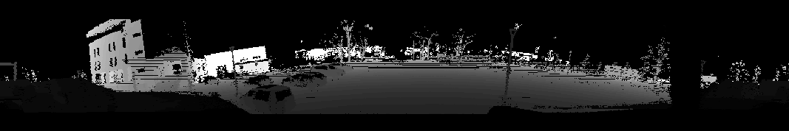
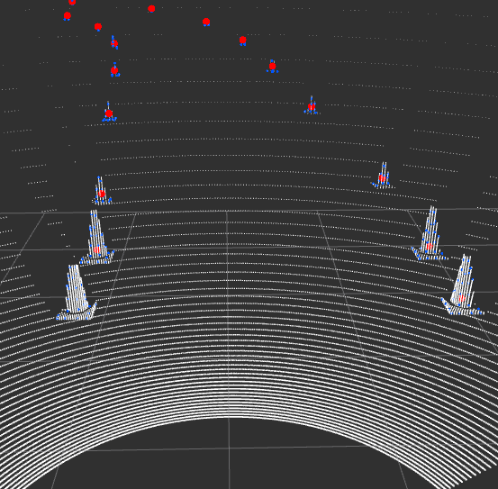

# ROS introduction/recap


[Robot Operating System (ROS)](https://en.wikipedia.org/wiki/Robot_Operating_System) is an open-source robotics middleware suite. Although ROS is not an operating system (OS) but a set of software frameworks for robot software development, it provides services designed for a heterogeneous computer cluster such as hardware abstraction, low-level device control, implementation of commonly used functionality, message-passing between processes, and package management.

> **_IMPORTANT:_**  There are two versions of ROS (ROS1 and ROS2) and many distributions. We will be working with ROS1 Noetic. ROS2 has some major differences about which you can read [here](https://roboticsbackend.com/ros1-vs-ros2-practical-overview/).

## ROS Computation Graph diagram


- **Nodes**: Nodes are processes that perform computation.

- **Master**: The ROS Master provides name registration and lookup to the rest of the Computation Graph. Without the Master, nodes would not be able to find each other, exchange messages, or invoke services.

- **Parameter Server**: The Parameter Server allows data to be stored by key in a central location.

- **Messages**: Nodes communicate with each other by passing messages. A message is simply a data structure, comprising typed fields.

- **Topics**: Messages are routed via a transport system with publish / subscribe semantics. A node sends out a message by publishing it to a given topic. The topic is a name that is used to identify the content of the message. A node that is interested in a certain kind of data will subscribe to the appropriate topic.

- **Services**: The publish / subscribe model is a very flexible communication paradigm, but its many-to-many, one-way transport is not appropriate for request / reply interactions, which are often required in a distributed system. Request / reply is done via services, which are defined by a pair of message structures: one for the request and one for the reply.

- **Bags**: Bags are a format (.bag) for saving and playing back ROS message data.

> **HINT:**  You can read more about ROS concepts [here](http://wiki.ros.org/ROS/Concepts).

> **HINT:**  Installation instructions for ROS1 can be found [here](http://wiki.ros.org/ROS/Tutorials/InstallingandConfiguringROSEnvironment). You can also use official ROS [docker images](https://hub.docker.com/_/ros).

## Catkin workspace and packages:
While working with ROS, you will be working inside a catkin workspace. Catkin workspace is a folder where you modify, build, and install catkin packages. Workspace lets you build multiple catkin packages together all at once. ROS nodes are written inside the catkin packages.

Before creating a catkin workspace make sure to source the ROS environment setup file to have access to ROS commands:
```bash
source /opt/ros/[YOUR_ROS_DISTRO]/setup.bash
```

To create a catkin workspace you have to create a directory with `src` folder and run `catkin_make`:
```bash
mkdir -p catkin_ws/src
cd catkin_ws
catkin_make
```

To build the ROS nodes (catkin packages) you have to run the same command in the same directory as above:
```bash
catkin_make
```

After building you have to source the environment variables. **Remember that you have to do that in every terminal in which you want to use the built code. Note that you should do that after every building operation to use newly built code.**
```bash
source devel/setup.bash
```

## Running nodes:

Before the execution of any node, you have to start a ROS system:
```bash
roscore
```

Running a single node:
```bash
rosrun [PACKAGE] [NODE_NAME]
```

Running a .launch file (with the use of .launch file you can, e.g. run multiple nodes with one command):
```bash
roslaunch [PACKAGE] [FILENAME].launch
```

## Working with topics:
Display the list of available topics:
```bash
rostopic list
```

Display the information about a specific topic: 
```bash
rostopic info [TOPIC]
```

Read messages published to the topic: 
```bash
rostopic echo [TOPIC]
```

Publish message to the topic: 
```bash
rostopic pub [TOPIC] [MSG_TYPE] [ARGS]
```

## Rosbags


> **HINT:**  More informations about ROS and more ROS tutorials can be found [here](http://wiki.ros.org/ROS/Tutorials).

# Point Clouds

<!-- > **_IMPORTANT:_**  Before proceeding to the rest of this instrucion, start downloading this file: https://chmura.put.poznan.pl/s/SnJSLZYvvxX6gaI -->

A [point cloud][1] is a discrete set of data points in space. The points may represent a 3D shape, object or scene. Each point position has its set of Cartesian coordinates (X, Y, Z). Point clouds are generally produced by 3D scanners, LIDARs or by photogrammetry software.

## Example data


## ROS point cloud message
ROS message for handling point clouds is PointCloud2 message from sensor_msgs subpackage:
```
# This message holds a collection of N-dimensional points, which may
# contain additional information such as normals, intensity, etc. The
# point data is stored as a binary blob, its layout described by the
# contents of the "fields" array.

# The point cloud data may be organized 2d (image-like) or 1d
# (unordered). Point clouds organized as 2d images may be produced by
# camera depth sensors such as stereo or time-of-flight.

# Time of sensor data acquisition, and the coordinate frame ID (for 3d
# points).
Header header

# 2D structure of the point cloud. If the cloud is unordered, height is
# 1 and width is the length of the point cloud.
uint32 height
uint32 width

# Describes the channels and their layout in the binary data blob.
PointField[] fields

bool    is_bigendian # Is this data bigendian?
uint32  point_step   # Length of a point in bytes
uint32  row_step     # Length of a row in bytes
uint8[] data         # Actual point data, size is (row_step*height)

bool is_dense        # True if there are no invalid points
```

# Point Cloud Library (PCL)


The [Point Cloud Library (PCL)](https://pointclouds.org/) is a standalone, open-source library for 2D/3D image and point cloud processing. The library contains algorithms for filtering, feature estimation, surface reconstruction, 3D registration, model fitting, object recognition, and segmentation. We will use PCL C++ API.

> **HINT:**  PCL documentation can be found [here](https://pointclouds.org/documentation/).

> **HINT:**  PCL tutorials can be found [here](https://pcl.readthedocs.io/projects/tutorials/en/master/). Using PCL in ROS is described [here](https://github.com/methylDragon/pcl-ros-tutorial/blob/master/PCL%20Reference%20with%20ROS.md).

## PCL installation:
Install PCL for ROS:
```bash
sudo apt install ros-[YOUR_ROS_DISTRO]-pcl-ros
```

Install useful PCL command line tools:
```bash
sudo apt install pcl-tools
```

## ROS package setup for PCL:
For the most general setup: 

Add these lines in `CMakeLists.txt`:

```cmake
find_package(PCL REQUIRED)
include_directories(${PCL_INCLUDE_DIRS})
link_directories(${PCL_LIBRARY_DIRS})
add_definitions(${PCL_DEFINITIONS})
target_link_libraries(YOUR_NODE_NAME ${catkin_LIBRARIES} ${PCL_LIBRARIES})
```

Add the following lines to `package.xml`:
```xml
<build_depend>pcl_conversions</build_depend>
<build_depend>pcl_ros</build_depend>
<exec_depend>pcl_conversions</exec_depend>
<exec_depend>pcl_ros</exec_depend>
```

## `pcl::PointCloud<PointT>` type
[pcl::PointCloud\<PointT>](https://pointclouds.org/documentation/singletonpcl_1_1_point_cloud.html) is the core point cloud class in the PCL library. This class has a similar structure to the PointCloud2 message type, including a header. It can be templated on any of the Point types listed in [point_types.hpp](https://pointclouds.org/documentation/point__types_8hpp_source.html), e.g.:
- **PointXYZ** - float x, y, z coordinates
- **PointXYZI** - float x, y, z coordinates and intensity
- **PointXYZRGB** - float x, y, z coordinates and rgb color

The points in the pcl::PointCloud<PointT> are stored in a `points` field as a vector.

Clouds in PCL are usually handled using [smart pointers](https://en.cppreference.com/book/intro/smart_pointers), e.g.:
```cpp
pcl::PointCloud<pcl::PointXYZ>::Ptr pcl_cloud
```

Converting between the ROS's sensor_msgs/PointCloud2 class and the point cloud template pcl::PointCloud\<PointT> class can be done with [`pcl::fromROSMsg`](http://docs.ros.org/en/indigo/api/pcl_conversions/html/namespacepcl.html#af662c7d46db4cf6f7cfdc2aaf4439760) and [`pcl::toROSMsg`](http://docs.ros.org/en/indigo/api/pcl_conversions/html/namespacepcl.html#af2c39730f92ade1603c55d45265e386d) from `pcl_conversions` package.

## PCD (Point Cloud Data)
[PCD (Point Cloud Data)](https://pointclouds.org/documentation/tutorials/pcd_file_format.html) is the primary data format in PCL. It was created because existing formats did not support some of the features provided by the PCL library. Point cloud can be saved in .pcd format with `pcl::io::savePCDFile` function. Point clouds saved in `.pcd` format can be displayed with the use of `pcl_viewer` command line tool from `pcl_tools` package. You can test it by downloading the example `.pcd` file and running the `pcl_viewer`:
```bash
wget https://raw.githubusercontent.com/PointCloudLibrary/pcl/master/test/bunny.pcd
pcl_viewer bunny.pcd
```

Point cloud in `.pcd` format can be loaded in code with `pcl::io::loadPCDFile` function.

The other common data formats for point clouds are: [.ply](https://en.wikipedia.org/wiki/PLY_(file_format)), [.las](https://www.asprs.org/divisions-committees/lidar-division/laser-las-file-format-exchange-activities), [.obj](https://en.wikipedia.org/wiki/Wavefront_.obj_file), [.stl](https://en.wikipedia.org/wiki/STL_(file_format)), [.off](https://en.wikipedia.org/wiki/OFF_(file_format)).

## Usage interface
Most of the PCL's functionalities (e.g., filters, segmentations) follow similar usage interface:
 - use `.setInputCloud()` to set the input cloud
 - set functionality-specific parameters with `.set...()`
 - depending on the functionality call `.compute()`, `.align()`, `.filter()`, etc. to get the output.

### PassThrough filter example:
(Passthrough filter filters values in or outside a specified range in one dimension)

```cpp
pcl::PassThrough<PointT> filter;
filter.setInputCloud(input_cloud);
filter.setFilterFieldName("x");
filter.setFilterLimits(0.0, 5.0);
filter.filter(output_cloud);
```

# Exercises

## Data download
Download the .bag files from following links:
- https://drive.google.com/file/d/1p1ispuGiPlfS1ECIAfG3PWv1O23Uc5QV/view?usp=sharing
- https://drive.google.com/file/d/1CxnU4j6ks-cgr-98fP-EOhiCWR9qaIWh/view?usp=sharing

## Docker container setup
To make things easier the docker image with PCL was prepared. 

1. Download the docker image from [here](https://drive.google.com/file/d/1alOw8N7yaGJsvyDE4tjfqaJsZJZHieUz/view?usp=sharing)

2. Load the image:

```bash
docker load < ros_noetic_pcl.tar
```

2. Add access to desktop environment for docker container
```bash
xhost +local:'docker inspect --format='.Config.Hostname' MP_PCL'
```

3. Run new docker container
```bash
docker run -it \
    --net=host \
    --env=DISPLAY=$DISPLAY \
    --env=NVIDIA_VISIBLE_DEVICES=all \
    --env=NVIDIA_DRIVER_CAPABILITIES=all \
    --volume=/tmp/.X11-unix:/tmp/.X11-unix:ro \
    --volume=/home/student/mp_docker:/home/share:rw \
    --env="QT_X11_NO_MITSHM=1" \
    --env="XAUTHORITY=$XAUTH" \
    --volume="$XAUTH:$XAUTH" \
    --privileged \
    --workdir=/home \
    --name=MP_PCL \
    ros_noetic_pcl \
    bash
```

> **NOTE:**  You will be able to exchange the data between the host machine and container using shared folder: `/home/student/mp_docker:/home/share`.

4. To attach to a container in different terminal you can run:
```bash
docker exec -it MP_PCL bash
```

## ROS package setup
1. Create a catkin workspace.
```bash
mkdir -p catkin_ws/src
cd catkin_ws
catkin_make
``` 

2. Clone the prepared ROS package to the workspace
```bash
cd src
git clone https://github.com/dmn-sjk/mp_pcl.git
```

3. Build the package and source the environment
```bash
cd ..
catkin_make
source devel/setup.bash
```

## Task 1 - Create a range image from point cloud

> **NOTE:**  Keep in mind that both PCL and OpenCV had to be installed and configured for the project.

The task is to fill the pixels of an image with the range values from LiDAR point cloud to create a range image, which might be easier to process by the neural network. The sensor data is from [ouster OS1-128](https://data.ouster.io/downloads/datasheets/datasheet-rev7-v3p0-os1.pdf) LiDAR. The dimensions of the image (1024x128) refer to the parameters of used LiDAR sensor (horizontal resolution: 1024, vertical resolution: 128).

1. Open `src/ex1.cpp` file from cloned package directory.
2. Calculate the horizontal and vertical angle of the laser beam for each point. Points outside of the vertical field of view of the sensor ($\pm$ 22.5 $^\circ$) should be discarded.
3. Calculate the pixel location on the image for each point.
4. Calculate the range value for each point. If the value of range is higher than 50 m, set it to 50 m.
5. Normalize pixel values from 0-50 to 0-255.
3. To check the results run the roslaunch and play back the LiDAR data recorded in `ouster.bag`. The range image is published and should be visible in rviz.

```bash
roslaunch mp_pcl ex1.launch
``` 
```bash
rosbag play --loop ouster.bag
``` 
> **NOTE:**  `--loop` flag makes the rosbag play in a loop.

Expected result:


## Task 2 - Detecting the cones in the point cloud with the use of PCL


Your task is to detect the cones in the cloud and estimate their center points. The LiDAR data was simulated and recorded from the [Formula Student Driverless Simulator](https://fs-driverless.github.io/Formula-Student-Driverless-Simulator/v2.2.0/).

1. Open `src/ex2.cpp` file from the cloned package.
2. Complete `filter` function to downsample the point cloud with voxel filter. Use [`pcl::VoxelGrid`](https://pointclouds.org/documentation/classpcl_1_1_voxel_grid.html) class. The leaf size can be set with `.setLeafSize` method. Observe how different leaf size values affect the output cloud.
3. Complete `remove_ground` function to remove ground from the point cloud, to be able to segment the cones in the next steps. You could just limit the value of points in `Z` axis, but to get familiar with PCL, fit the plane to the point cloud using RANSAC algorithm using [pcl::SACSegmentation](https://pointclouds.org/documentation/classpcl_1_1_s_a_c_segmentation.html) and extract "inlier points" from the original cloud with [pcl::ExtractIndices](https://pointclouds.org/documentation/classpcl_1_1_extract_indices_3_01pcl_1_1_p_c_l_point_cloud2_01_4.html).
4. Complete `get_cluster_indices` function. Use euclidan clustering ([pcl::EuclideanClusterExtraction](https://pointclouds.org/documentation/classpcl_1_1_euclidean_cluster_extraction.html)) to get cones clusters. Make the function return the vector of cluster indices.
5. Complete `get_cones_centers_cloud` by calculating the average position of points in each cone cluster. You can calculate the average of each dimension manually or use [pcl::CentroidPoint](http://pointclouds.org/documentation/classpcl_1_1_centroid_point.html). Append the calculated average points to the `output_cones_cloud`. Keep in mind that `output_cluster_indices` is a vector of `pcl::PointIndices`. Single `pcl::PointIndices` has point indices from a single cluster (`pcl::PointIndices.indices` - another vector). 
6. To check the results run the roslaunch and playback the data from `fsds_lidar.bag`:

```bash
roslaunch mp_pcl ex2.launch
``` 

```bash
rosbag play --loop fsds_lidar.bag
```

The final result should look like this (white points - unprocessed cloud, blue points - downsampled cloud without ground points, red points - centers of cones):




<!-- [1]: <https://en.wikipedia.org/wiki/Point_cloud> "Point cloud on wikipedia"
[2]: <https://velodynelidar.com/wp-content/uploads/2020/07/A-Guide-to-Lidar-Wavelengths-Velodyne-Lidar-AlphaPrime-1.jpg> "Point cloud image from velodyne" -->