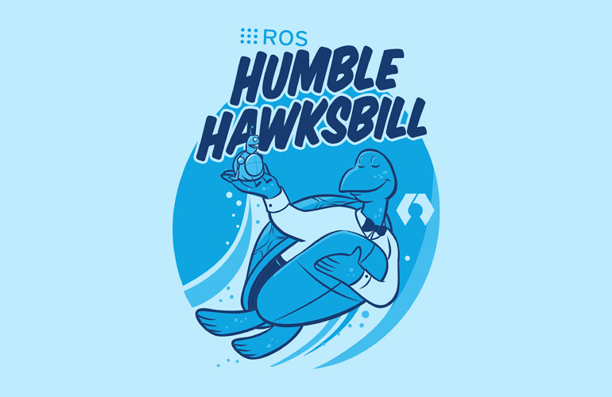
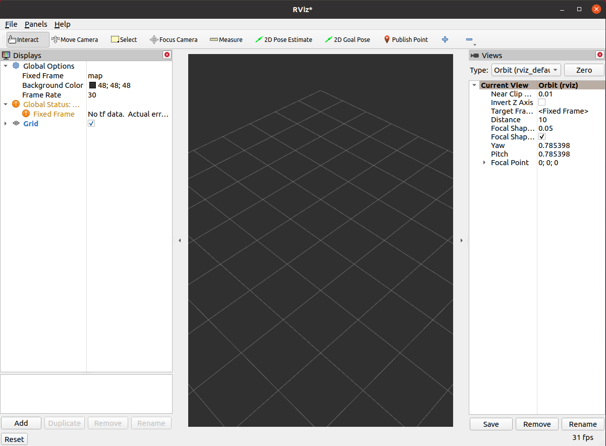
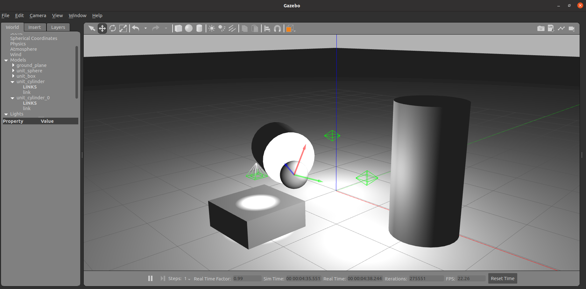
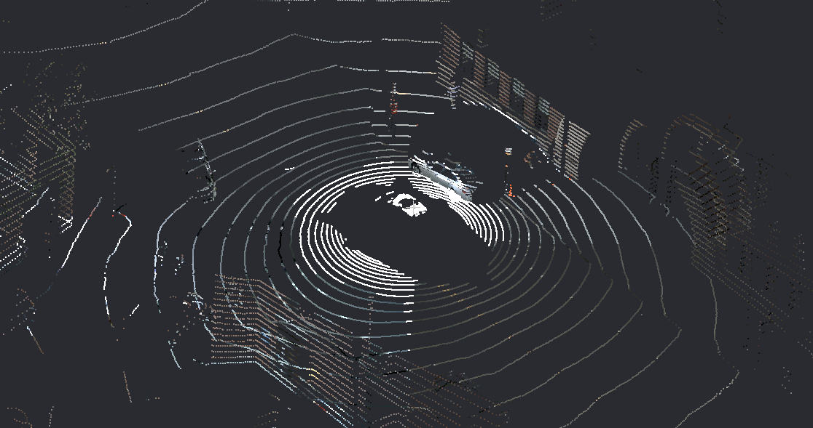
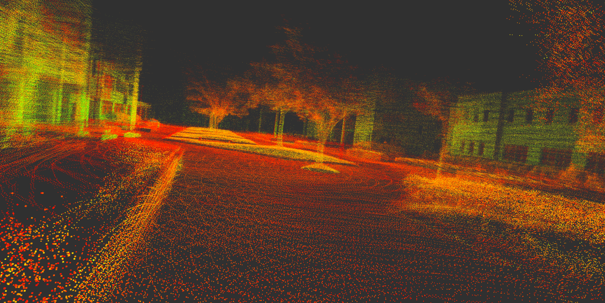

# Goals of the Class
In this class, you will use ROS2 (Robot Operating System 2) to perform 2D SLAM (Simultaneous Localization and Mapping) and AMCL (Adaptive Monte Carlo Localization) with a simulated Turtlebot3 robot. Moreover, you will map the real 3D environment using data recorded from 3D LIDAR sensor. You will:

- Generate a 2D map of the robot’s environment using LIDAR.
- Enable the robot to navigate autonomously within this known map.
- Extend your skills to 3D localization by creating a 3D map using a laser scanner and the lidarslam package.

# Before You Begin
To complete the exercises, you’ll need two Docker images: `arm/lab03` (for 2D SLAM and navigation) and `arm/lab06` (for 3D SLAM). These images contain pre-configured ROS2 environments with all required tools and dependencies.

## Check and Download Docker Images
Verify if the images are already on your computer:

```bash
docker images
```
Look for `arm/lab03` and `arm/lab06` in the output.

If they’re missing, download them:

For `arm/lab03`:
```bash
wget --content-disposition --no-check-certificate https://chmura.put.poznan.pl/s/pszNFePmGXxu1XX/download
```
For `arm/lab06`:
```bash
wget --content-disposition --no-check-certificate https://chmura.put.poznan.pl/s/B1td9ifRL1S0js9/download
```

Load the downloaded .tar.gz files into Docker:

```bash
docker load < path/to/file.tar.gz
```

# ROS2 Introduction / Recap

<p align="center">

</p>

The Robot Operating System (ROS) is a set of open-source development libraries and tools for building robotic applications. 
We will use one of the latest stable versions of ROS2, [Humble Hawksbill](https://docs.ros.org/en/rolling/Releases.html). 

## Key ROS2 [Concepts](https://docs.ros.org/en/humble/Concepts.html#graph-concepts)

Here’s a breakdown of essential terms:

- **Nodes**: Small, independent programs that perform specific tasks (e.g., reading a sensor or moving a motor). Nodes communicate within a **ROS graph**, a network showing how they exchange data.
- **Topics**: Channels where nodes send and receive data using a publish/subscribe model. For example, a node might publish a robot’s position to the `/robot/position` topic, while another subscribes to display it.
- **Messages**: Structured data sent over topics, defined in `.msg` files (e.g., `geometry_msgs/msg/Twist` for velocity commands).

<p align="center">

</p>

### ROS2 Environment (_Workspace_)

A ROS environment is the place where packages are stored, e.g. for a particular robot. There can be many different environments on one computer (e.g. _ros2_robotA_ws_, _ros2_robotB_ws_). A typical workspace looks like this:

```text
ros2_ws
├── build/    # Temporary files for building packages
├── install/  # Compiled packages ready to use
├── log/      # Build process logs
└── src/      # Your source code and packages
```

#### Building the Workspace
Use the [`colcon`](https://colcon.readthedocs.io/en/released/) tool to build the workspace:

```bash
cd ros2_ws
colcon build
```

#### Activating the Workspace
After building, “source” the environment to access your packages in the terminal:

```bash
source install/setup.bash
```

> **Note**: Run this command in every new terminal session to work with your workspace.

### Node Operations

Starting nodes is done via the command:

```bash
ros2 run package_name node_name
```

It is possible to group nodes allowing them to be run collectively. The `launch` files are used for this. Invoking an existing `launch` file is done by the command:

```bash
ros2 launch package_name launch_name
```

### Topic Operations

Viewing the current list of topics is done using the command:

```bash
ros2 topic list
```

Reading messages from the topic:

```bash
ros2 topic echo topic_name
```

A single topic can have multiple publishers as well as subscribers. Information about them, as well as the type of message being exchanged, can be checked with the command:

```bash
ros2 topic info topic_name
```

It is also possible to publish messages on a topic from the terminal:

```bash
ros2 topic pub topic_name message_type 'message_data'
```

## Useful Tools

- **RViz**: A 3D visualization tool to display sensor data and robot models:
```bash
rviz2
```

<p align="center">

</p>

- **Gazebo**: A simulation environment to create a working environment for your robot and simulate its interaction with objects:
```bash
gazebo
```

<p align="center">

</p>

## ROS2 Bag: Recording and Playback
**ROS2 Bag** lets you record and replay topic data, useful for testing without a live robot:

- **Record**: `ros2 bag record /topic1 /topic2`
- **Play**: `ros2 bag play bag_name -r 0.5` (half speed)
- **Info**: `ros2 bag info bag_name`

## Multi-Computer Setup

Nodes in the same domain can freely detect and send messages to each other. 
All ROS2 nodes use domain ID 0 by default. Within the laboratory, **it is necessary to set a separate unique domain ID for each computer to avoid interference.** 
To do this, read the number from the sticker stuck to the monitor and substitute it in the following command in place of `NR_COMPUTER`. If there is no sticker on your computer, select a number between 0-101 or 215-232.

```bash
grep -q ^'export ROS_DOMAIN_ID=' ~/.bashrc || echo 'export ROS_DOMAIN_ID=NR_COMPUTER' >> ~/.bashrc
source ~/.bashrc
```

---

# Part 1: 2D Point Cloud SLAM and Navigation in a Simple Environment

In this part, you’ll use a simulated Turtlebot3 to build a 2D map with SLAM and localize it within a known map with AMCL.

## Key Concepts
- **SLAM (Simultaneous Localization and Mapping)**: A technique where a robot builds a map of an unknown area while tracking its position. Here, we will use [Cartographer](https://google-cartographer-ros.readthedocs.io/en/latest/algo_walkthrough.html), a Google-developed SLAM system that localizes and creates maps from [LIDAR](https://en.wikipedia.org/wiki/Lidar) data. It uses scan matching to estimate relative motion between consecutive point clouds and refines the localization estimates using pose graph optimization.

<figure align="center">

<figcaption>Advantages of cleaning robots using SLAM. <a href="https://www.mathworks.com/discovery/slam.html"><sup>source</sup></a></figcaption>
</figure>

- **AMCL (Adaptive Monte Carlo Localization)**: A method to locate a robot on **a known map** using particle filter. AMCL represents the robot’s possible positions as a set of particles, where each particle is a hypothesis of the robot’s location with an associated weight reflecting its likelihood. The algorithm updates these particles based on the robot’s motion (using a motion model) and sensor data (using a sensor model), then resamples them to focus on the most probable positions.

<figure align="center">
<figcaption>Arrows are particles calculated by AMCL. <a href="https://cmuq-robotics.github.io/lab4.html"><sup>source</sup></a></figcaption></figure>

- **Point Cloud**: A collection of points in space representing the environment’s geometry. They are produced by LIDAR sensors.
<p align="center">
  
</p>

## Environment preparation
1. **Load the Docker Image**: Use `arm/lab03` (see [Before You Begin](#before-you-begin)).
2. **Create a Contrainer**:
- only CPU: Download and run [run_cpu.sh](https://raw.githubusercontent.com/dmn-sjk/MPProject/refs/heads/main/MP_BOT/run_cpu.sh)
- GPU: Download and run [run_gpu_nvidia.sh](https://raw.githubusercontent.com/dmn-sjk/MPProject/refs/heads/main/MP_BOT/run_gpu_nvidia.sh)
```bash
wget <script_url>
bash run_*.sh
```

The container is named `ARM_03` by default.

4. **Build the Workspace**:
```bash
cd /arm_ws
source /opt/ros/humble/setup.bash
colcon build --symlink-install
source install/setup.bash
```

> **NOTE**: You can attach a new terminal to the container using the following command: `docker exec -it ARM_03 bash`

> **IMPORTANT**: 
>
> 1. Make sure to source the built environment and set the robot model in every terminal inside the container: `source install/setup.bash; export TURTLEBOT3_MODEL=burger`
>
> 2. Set the environment variable `ROS_DOMAIN_ID` in a container as instructed [here](#multi-computer-setup).

## Building the World Map
1. **Launch Gazebo Simulation**:
```bash
export TURTLEBOT3_MODEL=burger
ros2 launch turtlebot3_gazebo turtlebot3_world.launch.py
```

2. **Run Cartographer SLAM** (new terminal):
```bash
export TURTLEBOT3_MODEL=burger
source install/setup.bash
ros2 launch turtlebot3_cartographer cartographer.launch.py use_sim_time:=True
```

RViz will show the map-building process.


3. **Move the Robot** with the `teleop` node for keyboard operation (new terminal):
```bash
source install/setup.bash
ros2 run turtlebot3_teleop teleop_keyboard
```
Then, using the keys ```w```, ```a```, ```s```, ```d``` and ```x```, you need to control the robot so that the entire "world" map is built.

<figure align="center">

<figcaption>"turtlebot3_world" with a map built. <a href="https://emanual.robotis.com/docs/en/platform/turtlebot3/slam_simulation/"><sup>source</sup></a></figcaption>
</figure>

4. **Save the Map** (new_terminal, while the SLAM and simulation are running):
```bash
source install/setup.bash
mkdir maps
ros2 run nav2_map_server map_saver_cli -f /arm_ws/maps/turtlebot3_world_map
```
This creates a `.yaml` and `.pgm` file representing the map.

5. **Turn off the Simulation** with `Ctrl+C` in all terminals.

## Navigating using the map
1. **Launch Gazebo Simulation**:
```bash
export TURTLEBOT3_MODEL=burger
ros2 launch turtlebot3_gazebo turtlebot3_world.launch.py
```

2. **Launch Navigation2 Node with AMCL method** (new terminal):
```bash
export TURTLEBOT3_MODEL=burger
ros2 launch turtlebot3_navigation2 navigation2.launch.py use_sim_time:=True map:=/arm_ws/maps/turtlebot3_world_map.yaml
```

3. **Set Initial Pose in RViz**:
- Click ```2D Pose Estimate``` in the RViz window.
- Click on the map in the place where you think the robot is located and drag it in the direction of its front.
- Repeat until the particle cloud aligns with the robot’s actual location.

<figure align="center">

<figcaption><a href="https://emanual.robotis.com/docs/en/platform/turtlebot3/nav_simulation/"><sup>source</sup></a></figcaption>
</figure>

Before the next step, you can also move the robot back and forth a bit utilizing previously used `teleop` node to collect the surrounding environment information and narrow down the estimated location of the robot on the map which is displayed with tiny green arrows.

4. **Set Navigation Goal**:
- Click `Navigation Goal` in RViz window.
- Click and drag to set a destination. The robot will plan and follow a path.

<figure align="center">

<figcaption><a href="https://emanual.robotis.com/docs/en/platform/turtlebot3/nav_simulation/"><sup>source</sup></a></figcaption>
</figure>

## Play with Parameters
In the ```turtlebot3_navigation2``` package, there is a config file ```/arm_ws/src/turtlebot3/turtlebot3_navigation2/param/burger.yaml```. You can verify how the modification of the following parameters affect the AMCL module operation:

  1. ```laser_max_range``` and ```laser_min_range```
  2. ```max_beams```
  3. ```max_particles```
  4. ```resample_interval```
  5. ```update_min_a``` and ```update_min_d```

Install you favorite editor if needed, e.g.:
```bash
apt update
apt install vim
```

# Part 2: 3D Point Cloud SLAM

Now, you’ll use [lidarslam](https://github.com/rsasaki0109/lidarslam_ros2) to build a 3D map from LIDAR data and analyze its performance.

**lidarslam**: A ROS2 package for 3D SLAM using point clouds. It uses scan matching method to calculate the relative transformation between consecutive LIDAR scans to get the initial estimate of the motion (i.e., [Normal Distributions Transform (NDT)](https://en.wikipedia.org/wiki/Normal_distributions_transform) by default). Moreover, it refines the intial pose estimates and ensures long-term consistency of the map by graph-based pose optimization. It includes loop closure mechanism.

Loop closure is a technique in SLAM where the system recognizes when the robot has returned to a previously visited location. When a loop closure is detected, the system can correct accumulated drift errors by adjusting the entire trajectory and map. This results in a more accurate and consistent map, especially for long trajectories where odometry errors would otherwise accumulate.

<p align="center">

</p>

## Environment Preparation
1. **Load the Docker Image**: Use `arm/lab06` (see [Before You Begin](#before-you-begin)).
2. **Create a Container**:
- only CPU: Download and run [run_cpu.sh](https://raw.githubusercontent.com/dmn-sjk/MPProject/refs/heads/main/MP_LIDARSLAM/run_cpu.sh)
- GPU: Download and run [run_gpu_nvidia.sh](https://raw.githubusercontent.com/dmn-sjk/MPProject/refs/heads/main/MP_LIDARSLAM/run_gpu_nvidia.sh)
```bash
wget <script_url>
bash run_*.sh
```

The container is named ARM_06 by default.

3. **Build the Workspace**:
```bash
cd /arm_ws
source /opt/ros/humble/setup.bash
colcon build --symlink-install
source install/setup.bash
```

> **NOTE**: You can attach a new terminal to the container using the following command: `docker exec -it ARM_06 bash`

## Running lidarslam

```shell
cd /arm_ws
source install/setup.bash
ros2 launch lidarslam lidarslam.launch.py
```

RViz window should appear, where the localization and map building process will be visualized.

## HDL_400

Play back the data recorded using [Velodyne VLP-32](https://www.mapix.com/lidar-scanner-sensors/velodyne/velodyne-vlp-32c/) LIDAR sensor.

1. **Play the bag file**:
```bash
ros2 bag play -p -r 0.5 bags/hdl_400
```

The replay process will start paused and with a ```rate``` of 0.5 of the normal speed.

2. **Add a ```PointCloud2``` data type** to the visualization from the ```/velodyne_points``` topic in RViz. It contains the "current" readings from the LIDAR.

3. **Unpause the replay process** of bag file by using space key in the appropriate terminal.

4. **Observe the difference** between maps from `/map` topic (raw map) and `/modified_map` topic (optimized map). Similarly observe the difference between `/path` (yellow) and `/modified_path` (green) topics. Unfortunately, there is no ground truth localization for this data, but you can see the map optimization process based on loop closure mechanism.

## KITTI 00

A bag file with 200 first scans from the 00 sequence of the [KITTI](https://www.cvlibs.net/datasets/kitti/) dataset was prepared. The data also contain *ground truth* localization, which can be used to assess the system performance.

1. **Restart lidarslam**:
```bash
ros2 launch lidarslam lidarslam.launch.py
```

2. **Play the bag file**:
```shell
ros2 bag play -p bags/kitti
```

3. **Add a ```Path``` data type** to the visualization from the ```/path_gt_lidar``` topic in RViz. Additionally, change it's color to distinguish it from different paths (yellow and green).

4. **Unpause the replay process of bag file** by using space key in the appropriate terminal.

5. **Observe the difference** between the ```ground truth``` line and the path returned by SLAM.

<!-- 6. **Repeat the experiment** for ```-r``` equal to 0.3. What happens this time? -->

You will likely observe that the SLAM algorithm processes data too slowly, resulting in a jagged trajectory that is significantly shorter than the ground truth. To verify this, repeat the experiment while playing the rosbag at a reduced speed (e.g., using the ```-r 0.3``` argument in the ros2 bag play command).

## Play with the parameters
Analyze the [lidarslam](https://github.com/rsasaki0109/lidarslam_ros2) documentation and observe the system in operation to verify the impact of the parameters located in ```/arm_ws/src/lidarslam_ros2/lidarslam/param/lidarslam.yaml```. Adjust these parameters to ensure the SLAM system operates somewhat accurately in real-time:

1. `ndt_resolution`
2. `trans_for_mapupdate`
5. `voxel_leaf_size`
6. `loop_detection_period`
7. `threshold_loop_closure_score`
8. `distance_loop_closure`
9. `range_of_searching_loop_closure`
10. `search_submap_num`

# Sources and useful references

- [ROS2 - developer guide](https://docs.ros.org/en/humble/The-ROS2-Project/Contributing/Developer-Guide.html)

- [ROS2 - documentation](https://docs.ros.org/en/humble/index.html)

- [ROS2 - design](http://design.ros2.org/)

- [ROS2 - installation](https://docs.ros.org/en/humble/Installation/Ubuntu-Install-Debians.html) - Desktop Install

- [Turtlebot3 Simulation docs](https://emanual.robotis.com/docs/en/platform/turtlebot3/slam_simulation/)