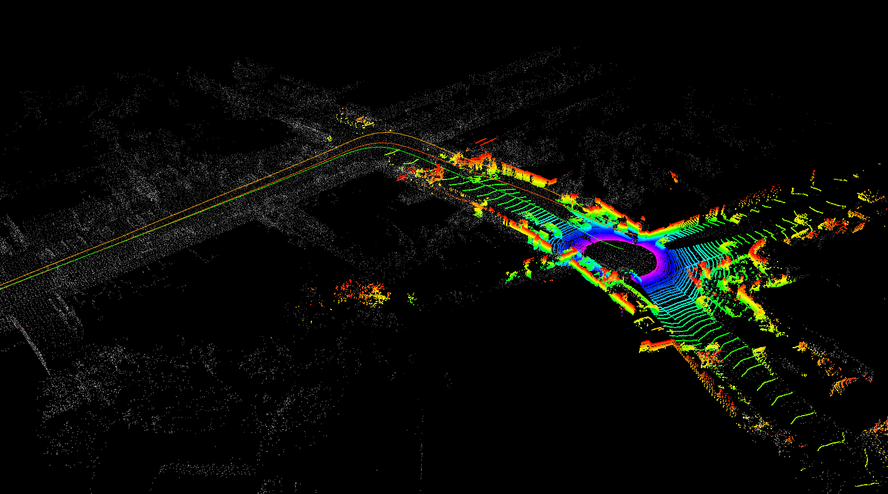
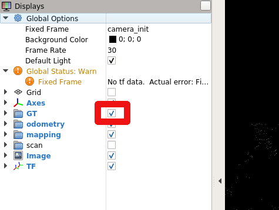
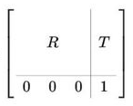
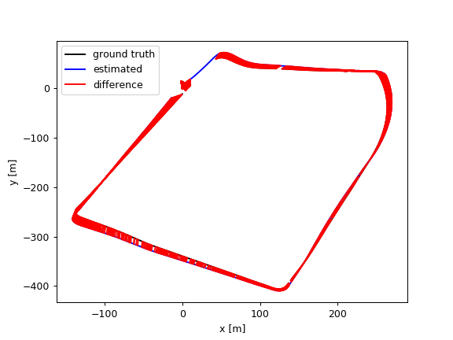

# Introduction:
SLAM (Simultaneous Localization and Mapping) is the computational problem of constructing or updating a map of an unknown environment while simultaneously keeping track of an agent's location within it.

> **_IMPORTANT:_** Before proceeding further, start to download two docker images, one for each SLAM system that will be used:  [image for A-LOAM](https://chmura.put.poznan.pl/s/YB0jqEXZbAq9EAU) and [image for ORB-SLAM3](https://chmura.put.poznan.pl/s/T98vgBxYTNZqgHO). Moreover, download the following .bag files: [arm_put_car.bag](https://chmura.put.poznan.pl/s/9pkDucSDiPlwgsd) and [kitti00_200.bag](https://chmura.put.poznan.pl/s/FRYaqg0pFVklQt5).

# LOAM
LOAM is a standard 3D laser localization method introduced in [LOAM: Lidar Odometry and Mapping in Real-time](http://www.roboticsproceedings.org/rss10/p07.pdf). In short, LOAM takes point clouds as input. Based on them, it estimates the odometry by scan registration with feature matching approach and maps the environment. It is also possible to include IMU measurements in the process. It is focused on minimizing drift in odometry estimation and the classic LOAM version does not involve a loop closure mechanism.

> **_HINT:_** The loop closure mechanism identifies revisited locations. Upon recognizing a return to a previously visited site, it corrects any accumulated errors in the estimated trajectory and map. This correction enhances the overall map accuracy and localization precision.

The original code is not available anymore since the authors made it private, creating [kaarta](https://www.kaarta.com/) company. We will instead use [A-LOAM](https://github.com/HKUST-Aerial-Robotics/A-LOAM) - Advanced implementation of LOAM. It uses Eigen and Ceres Solver to simplify and create a clean code structure, which makes it a perfect learning material for SLAM beginners.

## Very general steps of LOAM operation:
1. The system detects edge and planar features in each scan based on local curvature and determines the exact moment of measurement for each point.
2. Each scan is first matched to the previous one to roughly estimate the transformation (odometry) and 'straighten out' the point cloud.
3. After 'straightening out', the scan is matched to the map (collection of all previous points) to further improve the quality of the alignment.


<!-- Differences between odometry and mapping:
- The odometry operates on points from different time steps, while mapping operates on points recalculated to a single, common time step.
- Odometry matches scans to scans, mapping matches scans to maps (sets of scans).
- Odometry is faster (± constant time), while mapping can be time-consuming (the map grows). -->


# TODO:
## Docker container setup
A-LOAM implementation makes use of some dependencies e.g., CERES and PCL, so for convenience, the docker image with all installed dependencies was prepared ([image for A-LOAM](https://chmura.put.poznan.pl/s/YB0jqEXZbAq9EAU)). You can check the Dockerfile [here](https://github.com/MichalNowicki/LabARM/blob/main/Lab03-LokalizacjaLiDAR3D/Dockerfile).

1. Load the downloaded docker image:
```bash
docker load < arm_image03.tar.gz
```

2. Run the docker container with [mp_loam_run_gpu_nvidia.sh](https://github.com/dmn-sjk/MPProject/blob/main/MP_LOAM/mp_loam_run_gpu_nvidia.sh) script if you have nvidia GPU or [mp_loam_run_cpu.sh](https://github.com/dmn-sjk/MPProject/blob/main/MP_LOAM/mp_loam_run_cpu.sh) script otherwise:
```bash
bash mp_loam_run_gpu_nvidia.sh
```

```bash
bash mp_loam_run_cpu.sh
```

3. You can attach to a running container in another terminal with:
```bash
docker exec -it MP_LOAM bash
```

> **_IMPORTANT:_** Remember to give container access to the display for each terminal session you open with the command: ```xhost +local:root```.

## A-LOAM setup

1. Download A-LOAM repository:
```bash
cd /catkin_ws/src
git clone https://github.com/HKUST-Aerial-Robotics/A-LOAM.git
```

2. Build the catkin workspace along with A-LOAM code and source the environment variables:
```bash
cd /catkin_ws
catkin_make
source devel/setup.bash
```

## Run A-LOAM:
We will test the A-LOAM system with the use of publically available [KITTI Odometry dataset](https://www.cvlibs.net/datasets/kitti/eval_odometry.php). It consists of 22 sequences, for 11 of which there are ground truth trajectories that can be used for the evaluation of the SLAM system. The data is not saved as .bag files, so to process it in ROS one can use `kitti_helper.launch` from the `aloam_velodyne` package. The whole dataset weights a lot and there is no point in using all of it during the classes, so the .bag file ([kitti00_200.bag](https://chmura.put.poznan.pl/s/FRYaqg0pFVklQt5)) with the first 200 scans of 00 sequence was prepared.

1. Run A-LOAM ROS node along with the visualisation in rviz:
```bash
roslaunch aloam_velodyne aloam_velodyne_HDL_64.launch
```

2. Replay the lidar data from downloaded .bag file:
```bash
rosbag play kitti00_200.bag
```

> **_HINT:_** You can copy data to the container with the `docker cp` command: `docker cp [FILE_TO_COPY] [CONTAINER_NAME]:[DIRECTORY_IN_THE_CONTAINER]`.

Expected result:
<p align="center">
    
</p>

In rviz you can see:
- the current point cloud scan (colored points)
- built map (white points)
- estimated trajectory (green line)
- ground truth trajectory (orange line)

> **_HINT:_** To see the ground truth trajectory click the square next to GT group in rviz:
<p align="center">
    
</p>

Considering the clear implementation, you can conveniently analyze the code. Notice the order of point cloud processing in the following files: `laserMapping.cpp`, `laserOdometry.cpp`, `scanRegistration.cpp`.

# ORB-SLAM3
[ORB-SLAM3](https://github.com/UZ-SLAMLab/ORB_SLAM3) is the first real-time SLAM library able to perform Visual, Visual-Inertial and Multi-Map SLAM with monocular, stereo and RGB-D cameras, using pin-hole and fisheye lens models. It is based on detecting the ORB features on an image, matching the features by the descriptors and final optimization. It is a third version of an ORB-SLAM system. A very brief changelog of versions:
- 2015, ORB-SLAM - monocular version
- 2017, ORB-SLAM2 - monocular, stereovision, RGB-D versions
- 2020, ORB-SLAM3 - monocular, stereovision, RGB-D versions, with or without IMU measurements. Combining multiple maps for a full world map building.

ORB-SLAM3 system consist of three threads:
- tracking thread - responsible for determining the change in position from frame to frame.
- mapping thread - responsible for improving localization accuracy by optimizing the connected poses and points in the map.
- loop closure thread - responsible for detecting the return to a known location and correcting drift.

The threads work asynchronously, which leads to obtaining slightly different results upon different runs.

## Steps of tracking (1-3) and mapping (4-6) processes:
1. Detection and description of ORB features in the image.
2. Matching features from the current and previous frame based on descriptors.
3. Calculation of transformation.
4. Verification if the frame is a key one (needed for improving the system accuracy).
5. Finding additional matches to the recently seen features from the map.
6. Transformation correction.

# TODO:
We will test the [stereovision](https://en.wikipedia.org/wiki/Computer_stereo_vision) (obtaining 3D information from two cameras placed apart) version of the system on our own data ([arm_put_car.bag](https://chmura.put.poznan.pl/s/9pkDucSDiPlwgsd)) recorded from the car which circled the Piotrowo campus. The whole route was about 1.3 km long. The data sequence consists of images from two cameras(~20 Hz), DGPS data (~10 Hz) and AHRS data (~200 Hz). DGPS data provided localization information with an accuracy of about several centimeters, which is enough for our purpose to evaluate the localization accuracy of the system.

## Docker container setup
ORB-SLAM3 has a couple of dependencies (Pangolin, OpenCV, Eigen3) and a few inconveniences in order to build it for ROS, so to save your time the docker image with ORB-SLAM3 and its dependencies installed was prepared ([image for ORB-SLAM3](https://chmura.put.poznan.pl/s/T98vgBxYTNZqgHO)). You can check the Dockerfile [here](https://github.com/MichalNowicki/LabARM/blob/main/Lab04-ORBSLAM3/Dockerfile).

1. Load the downloaded docker image:
```bash
docker load < arm_image04.tar.gz
```

2. Run the docker container with [mp_orb3_run_gpu_nvidia.sh](https://github.com/dmn-sjk/MPProject/blob/main/MP_ORB3/mp_orb3_run_gpu_nvidia.sh) script if you have nvidia GPU or [mp_orb3_run_cpu.sh](https://github.com/dmn-sjk/MPProject/blob/main/MP_ORB3/mp_orb3_run_cpu.sh) script otherwise:
```bash
bash mp_orb3_run_gpu_nvidia.sh
```

```bash
bash mp_orb3_run_cpu.sh
```

3. You can attach to a running container in another terminal with:
```bash
docker exec -it MP_ORB3 bash
``` 

## Stereo vision camera calibration:
To run the stereovision version of the ORB-SLAM3 on our data we have to provide the parameters of the used camera configuration. The initially prepared configuration file `PP.yaml` can be found in the `/ORB-SLAM3/Examples/Stereo` directory. Current values are correct for a different camera configuration, so the task is to correct the values. You have to modify the following parameters:
- Camera.fx - focal length
- Camera.fy - focal length
- Camera.cx - principal point coordinate
- Camera.cy - principal point coordinate
- Camera.width (set to 720)
- Camera.height (set to 540)
- Camera.bf - horizontal focal length multiplied by the baseline of stereovision system. It refers to the absolute value located in the upper right corner of the P2 matrix in output of `stereoRectify` script mentioned below. The baseline is the distance between cameras.
- LEFT.height (set to 540)
- LEFT.width (set to 720)
- LEFT.D - distortion coefficients of left camera
- LEFT.K - camera intrinsic matrix of left camera
- LEFT.R - rectification transform (rotation matrix) for the left camera
- LEFT.P - projection matrix in the rectified coordinate systems for the left camera
- RIGHT.height (set to 540)
- RIGHT.width (set to 720)
- RIGHT.D - distortion coefficients of right camera
- RIGHT.K - camera intrinsic matrix of right camera
- RIGHT.R - rectification transform (rotation matrix) for the right camera
- RIGHT.P - projection matrix in the rectified coordinate systems for the right camera

To obtain all of the necessary stereovision system parameters, it has to be calibrated. In this example, it was already done with the use of [kalibr toolbox](https://github.com/ethz-asl/kalibr). [Here](https://github.com/ethz-asl/kalibr/wiki/multiple-camera-calibration) is the description of how it was done. The output of the calibration process was the following (you can also find it in `/ORB_SLAM3/scripts/stereoCalibrationResult.txt`):
```bash
cam0:
  cam_overlaps: [1]
  camera_model: pinhole
  distortion_coeffs: [-0.23248459123344795, 0.08191912671589296, 7.839314739418238e-05, 4.2075874672940684e-05]
  distortion_model: radtan
  intrinsics: [589.7363083173951, 590.0729541236071, 369.91183932674056, 298.34374442536097]
  resolution: [720, 540]
  rostopic: /pylon_stereo_node/left/image_raw
cam1:
  T_cn_cnm1:
  - [0.9997283077554007, 0.02320592542857902, 0.0021899081072863703, -0.32185797263546406]
  - [-0.0232254786906617, 0.9996863295720175, 0.00937121157638949, 0.0074867236444067856]
  - [-0.001971753560855992, -0.00941952715496201, 0.9999536912757833, -0.002949869596374046]
  - [0.0, 0.0, 0.0, 1.0]
  cam_overlaps: [0]
  camera_model: pinhole
  distortion_coeffs: [-0.2303444874136257, 0.07876654742388302, 9.186197190170094e-05,
    -0.0005160611286370294]
  distortion_model: radtan
  intrinsics: [589.5069022640636, 589.958834706832, 379.29038618376575, 283.91319737264314]
  resolution: [720, 540]
  rostopic: /pylon_stereo_node/right/image_raw
```

> **_HINT:_** The explanation of the output above can be found [here](https://github.com/ethz-asl/kalibr/wiki/yaml-formats) and [here](https://github.com/ethz-asl/kalibr/wiki/supported-models). `kalibr` notation of camera intrinsics [fu fv pu pv] is equivalent to [fx fy cx cy].

Some of the parameters can be taken directly from the `kalibr` calibration output. To obtain the `bf` value, `R`, and `P` matrices, we have to use [stereoRectify](https://docs.opencv.org/3.4/d9/d0c/group__calib3d.html#ga617b1685d4059c6040827800e72ad2b6) function from `OpenCV`, which calculates the transformations (`R`, `P`) necessary to get and use the canonical camera configuration (re-project image planes onto a common plane parallel to the line between optical centers of images) for depth estimation. You can use the prepared script template `/ORB-SLAM3/scripts/stereoCalibration.py` and fill the values of `K` (camera intrinsic matrix), `d` (distortion coefficients vector), `R` (rotation matrix) and `T` (translation vector). You should also adjust the image size in `stereoRectify()`function call from (0, 0) to (720, 540). To get the output of `stereoRectify()` run:

```bash
python /ORB_SLAM3/scripts/stereoCalibration.py
```

> **_HINT:_** Notice if the transformation (R, T) is meant to transform the coordination system of left camera to the coordinate system of right camera or the other way around.

Camera intrinsic matrix:

<p align="center">
    
</p>

[Homogeneous transformation matrix](https://mecharithm.com/learning/lesson/homogenous-transformation-matrices-configurations-in-robotics-12) (`T_cn_cnm1` is in this form):

<p align="center">
    
</p>

## Run ORB-SLAM3:

1. Run roscore:
```bash
roscore
```

2. Run ORB-SLAM3 ROS node along with the visualization (insert the correct topic names for the left and right camera topics - `rosbag info [.bag file]`):
```bash
cd /ORB_SLAM3/
rosrun ORB_SLAM3 Stereo /ORB_SLAM3/Vocabulary/ORBvoc.txt Examples/Stereo/PP.yaml true [topicLeft] [topicRight]
```

3. Replay the lidar data from the downloaded .bag file:
```bash
rosbag play -r 0.25 --pause arm_put_car.bag
```
> **_HINT:_** --pause means that the data will be played after pressing the spacebar. Since the ORB-SLAM3 is quite computationally demanding, we slow down the publish rate with the -r flag (0.25 - 4 times slower).

4. After the replay of all data, shut down the ORB-SLAM3 node with `ctrl + c`. The output trajectory will be saved to `FrameTrajectory_TUM_Format.txt`. Move it to the `scripts` directory:
```bash
mv /ORB_SLAM3/FrameTrajectory_TUM_Format.txt /ORB_SLAM3/scripts/orbslam3.txt
```

## Trajectory evaluation:
To evaluate the output trajectory we will compare it with the DGPS data as a ground truth. DGPS data is already processed to the correct format (TUM trajectory format with poses in [UTM coordinate system](https://en.wikipedia.org/wiki/Universal_Transverse_Mercator_coordinate_system)). You can download it from [here](https://chmura.student.put.poznan.pl/s/7axxzw5EXqaM2Oy). We will use the evaluation script from the ORB-SLAM3 repository: `avaluate_ate.py`. Run the evaluation with:

```bash
cd /ORB_SLAM3/scripts
python evaluate_ate.py dgps.txt orbslam3.txt --verbose --plot trajs.png
```

Example output:
```bash
compared_pose_pairs 1460 pairs
absolute_translational_error.rmse 21.493264 m
absolute_translational_error.mean 20.317460 m
absolute_translational_error.median 22.098146 m
absolute_translational_error.std 7.011507 m
absolute_translational_error.min 9.798730 m
absolute_translational_error.max 35.219433 m
```

The script computes the best overlap of the two given trajectories and calculates the absolute translational error. The system is not deterministic so the results can vary a little between runs. The output trajectories can be displayed with:
```bash
eog trajs.png
```

Example trajectories:
<p align="center">
    
</p>
