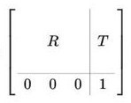

# Introduction:
SLAM (Simultaneous Localization and Mapping) is the computational problem of constructing or updating a map of an unknown environment while simultaneously keeping track of an agent's location within it.

> **_IMPORTANT:_** Before proceeding further, start to download the [docker image](https://drive.google.com/file/d/1ug5cWpce5J-Ykewo_XonlAZYNBIe4dXT/view?usp=sharing).

## ORB-SLAM3
[ORB-SLAM3](https://github.com/UZ-SLAMLab/ORB_SLAM3) is the first real-time SLAM library able to perform Visual, Visual-Inertial and Multi-Map SLAM with monocular, stereo and RGB-D cameras, using pin-hole and fisheye lens models. It is based on detecting the ORB features on an image, matching the features by the descriptors and final optimization. It is a third version of an ORB-SLAM system. A very brief changelog of versions:

- 2015, ORB-SLAM - monocular version
- 2017, ORB-SLAM2 - monocular, stereo vision, RGB-D versions
- 2020, ORB-SLAM3 - monocular, stereo vision, RGB-D versions, with or without IMU measurements. Combining multiple maps for a full world map building.

ORB-SLAM3 system consist of three threads:

- tracking thread - responsible for determining the change in position from frame to frame.
- mapping thread - responsible for improving localization accuracy by optimizing the connected poses and points in the map.
- loop closure thread - responsible for detecting the return to a known location and correcting drift.

The threads work asynchronously, which leads to obtaining slightly different results upon different runs.

### Steps of ORB SLAM3 processes:
Tracking:

1. Detection and description of ORB features in the image.
2. Matching features from the current and previous frame based on descriptors.
3. Calculation of transformation.

Mapping:

4. Verification if the frame is a key one (needed for improving the system accuracy).
5. Finding additional matches to the recently seen features from the map.
6. Transformation correction.

## Stereo vision
We will test the [stereo vision](https://en.wikipedia.org/wiki/Computer_stereo_vision) version of the ORB-SLAM3 system.

Stereo vision is a technique used to perceive depth. It works by capturing two images of the same scene from slightly different viewpoints using two cameras. The process involves:

1. Identifying corresponding points: Features present in both images are matched.
2. Calculating disparity: The difference in position (horizontal shift) of these corresponding points between the two images is measured.
3. Determining depth: The disparity is inversely proportional to the distance from the cameras—larger disparities indicate closer objects, while smaller disparities indicate farther ones.
4. By analyzing this disparity across the images, a depth map can be computed, enabling 3D visualization of the scene.

<figure align="center">

<figcaption><a href="https://www.techbriefs.com/component/content/article/14925-a-guide-to-stereo vision-and-3d-imaging"><sup>source</sup></a></figcaption>
</figure>


# Running ORB-SLAM3 on the data custom stereo vision data:
The ORB-SLAM3 system will be tested on the data recorded from the car which circled the Piotrowo campus. The whole route was about 1.3 km long. The data sequence consists of images from two cameras(~20 Hz), DGPS data (~10 Hz). DGPS data provided localization information with an accuracy of about several centimeters, which is enough for our purpose to evaluate the localization accuracy of the system.

## Environment preparation

1. **Allow the container to display GUI applications** (on a host machine):
```bash
xhost +local:root
```

2. Load the downloaded docker image with ORB-SLAM3 setup. You can also use the [Dockerfile](https://drive.google.com/file/d/1y3yZX7dSAYyjK3ouSu1jaTQAgyGrHHVj/view?usp=sharing) to build the image yourself but it will likely take more time.
```bash
docker load < path/to/file.tar.gz
```

2a. If you build the docker image from Dockerfile, download and run the docker image building script:
```bash
wget https://raw.githubusercontent.com/kamilmlodzikowski/LabARM/main/Lab07-ORB-SLAM/arm_07_build.sh
bash arm_07_build.sh
```

3. Download the script for running the docker container: [arm_07_run_gpu_nvidia.sh](https://raw.githubusercontent.com/kamilmlodzikowski/LabARM/main/Lab07-ORB-SLAM/arm_07_run_gpu_nvidia.sh) if you use nvidia GPU or [arm_07_run_cpu.sh](https://raw.githubusercontent.com/kamilmlodzikowski/LabARM/main/Lab07-ORB-SLAM/arm_07_run_cpu.sh) script otherwise. Run the container:
```bash
wget <script_link>
bash <script_name>.sh
```
> **NOTE**: You can attach a new terminal to the container using the following command: `docker exec -it ARM_07 bash`

4. Set ROS_DOMAIN_ID environment variable (replace `<CHOSEN_NUMBER>` with a random number between 0-101 or 215-232):
```bash
grep -q ^'export ROS_DOMAIN_ID=' ~/.bashrc || echo 'export ROS_DOMAIN_ID=<CHOSEN_NUMBER>' >> ~/.bashrc
source ~/.bashrc
```

## Stereo vision camera calibration
To run the stereo vision version of the ORB-SLAM3 on our data, we have to provide the parameters of the used camera configuration. The initially prepared configuration file `PP.yaml` can be found in the `/arm_ws/src/orbslam3_ros2/config/stereo` directory. Current values are correct for a different camera configuration, so the task is to correct the values. You have to modify the following parameters:

- `Camera.fx` - focal length
- `Camera.fy` - focal length
- `Camera.cx` - principal point coordinate
- `Camera.cy` - principal point coordinate
- `Camera.width` - width of the camera image in pixels (set it to 720)
- `Camera.height` - height of the camera image in pixels (set it to 540)
- `Camera.bf` - horizontal focal length multiplied by the baseline of stereo vision system. It refers to the absolute value located in the upper right corner of the P2 matrix in the output of `stereoRectify` script mentioned below. The baseline of the stereo vision system is the distance between cameras.
- `LEFT.height` - height of the left camera image in pixels (set it to 540)
- `LEFT.width` - width of the left camera image in pixels (set it to 720)
- `LEFT.D` - distortion coefficients of left camera
- `LEFT.K` - camera intrinsic matrix of left camera
- `LEFT.R` - rectification transform (rotation matrix) for the left camera
- `LEFT.P` - projection matrix in the rectified coordinate systems for the left camera
- `RIGHT.height` - height of the right camera image in pixels (set it to 540)
- `RIGHT.width` - width of the right camera image in pixels (set it to 720)
- `RIGHT.D` - distortion coefficients of right camera
- `RIGHT.K` - camera intrinsic matrix of right camera
- `RIGHT.R` - rectification transform (rotation matrix) for the right camera
- `RIGHT.P` - projection matrix in the rectified coordinate systems for the right camera

To obtain all of the necessary stereo vision system parameters, it has to be calibrated. In this example, it was already done with the use of [kalibr toolbox](https://github.com/ethz-asl/kalibr). [Here](https://github.com/ethz-asl/kalibr/wiki/multiple-camera-calibration) is the description of how it was done.

In short, a stereo vision system is calibrated by capturing multiple synchronized image pairs of a known calibration pattern, such as a checkerboard, using both cameras. The calibration pattern has to be visible in the field of view of both cameras. Feature points (e.g., corners) are detected in each image, and their correspondences across the two views are identified. Such set of images is used ot estimate the intrinsic parameters of both cameras (focal length, principal point, distortion coefficients) and extrinsic parameters of a stereo vision system (rotation and translation between cameras) using an optimization process.

<figure align="center">

<figcaption><a href="https://araintelligence.com/blogs/computer-vision/geometric-vision/camera_calibration"><sup>source</sup></a></figcaption>
</figure>

The output of the calibration process from `kalibr` was the following:
```bash
cam0:
  cam_overlaps: [1]
  camera_model: pinhole
  distortion_coeffs: [-0.23248459123344795, 0.08191912671589296, 7.839314739418238e-05, 4.2075874672940684e-05]
  distortion_model: radtan
  intrinsics: [589.7363083173951, 590.0729541236071, 369.91183932674056, 298.34374442536097]
  resolution: [720, 540]
  rostopic: /pylon_stereo_node/left/image_raw
cam1:
  T_cn_cnm1:
  - [0.9997283077554007, 0.02320592542857902, 0.0021899081072863703, -0.32185797263546406]
  - [-0.0232254786906617, 0.9996863295720175, 0.00937121157638949, 0.0074867236444067856]
  - [-0.001971753560855992, -0.00941952715496201, 0.9999536912757833, -0.002949869596374046]
  - [0.0, 0.0, 0.0, 1.0]
  cam_overlaps: [0]
  camera_model: pinhole
  distortion_coeffs: [-0.2303444874136257, 0.07876654742388302, 9.186197190170094e-05,
    -0.0005160611286370294]
  distortion_model: radtan
  intrinsics: [589.5069022640636, 589.958834706832, 379.29038618376575, 283.91319737264314]
  resolution: [720, 540]
  rostopic: /pylon_stereo_node/right/image_raw
```

> **_HINT:_** The explanation of the output above can be found [here](https://github.com/ethz-asl/kalibr/wiki/yaml-formats) and [here](https://github.com/ethz-asl/kalibr/wiki/supported-models). `kalibr` notation of camera intrinsics [fu fv pu pv] is equivalent to [fx fy cx cy].

Some of the parameters can be taken directly from the `kalibr` calibration output (`Camera.fx`, `Camera.fy`, `Camera.cx`, `Camera.cy`, `LEFT.height`, `LEFT.width`, `LEFT.D`, `LEFT.K`, `RIGHT.height`, `RIGHT.width`, `RIGHT.D`, `RIGHT.K`). 

To obtain the `bf` value, `R`, and `P` matrices, we have to use [stereoRectify](https://docs.opencv.org/3.4/d9/d0c/group__calib3d.html#ga617b1685d4059c6040827800e72ad2b6) function from `OpenCV`, which calculates the transformations (`R`, `P`) necessary to get and use the canonical camera configuration (re-project image planes onto a common plane parallel to the line between optical centers of images) for depth estimation. 

You can use the prepared script template `/arm_ws/src/orbslam3_ros2/scripts/stereoCalibration.py`. Firstly, fill the values in the script, based on the above `kalibr` calibration output: 

- `K1` and `K2` - camera intrinsics matrices,
- `d1` and `d2` - distortion coefficients vectors
- `R` - rotation matrix
- `T` - translation vector. 

You should also adjust the image size in `stereoRectify()`function call from (0, 0) to (720, 540). 

To get the output of `stereoRectify()` run:
```bash
python /arm_ws/src/orbslam3_ros2/scripts/stereoCalibration.py
```

<!-- > **_HINT:_** Notice if the transformation (R, T) is meant to transform the coordination system of left camera to the coordinate system of right camera or the other way around. -->

### Useful knowledge:

Camera intrinsic matrix:

<p align="center">
    
</p>

[Homogeneous transformation matrix](https://mecharithm.com/learning/lesson/homogenous-transformation-matrices-configurations-in-robotics-12) (`T_cn_cnm1` is in this form):

<p align="center">
    
</p>

## Run ORB-SLAM3:

1. Run ORB-SLAM3 ROS node along with the visualization:
```bash
ros2 run orbslam3 stereo /arm_ws/src/orbslam3_ros2/vocabulary/ORBvoc.txt /arm_ws/src/orbslam3_ros2/config/stereo/PP.yaml true
```

2. Replay the bag file:
```bash
ros2 bag play -r 0.25 bags/put_car -p --remap /pylon_stereo_node/left/image_raw:=/camera/left /pylon_stereo_node/right/image_raw:=/camera/right
```

3. After the replay of all data, shut down the ORB-SLAM3 node with `ctrl + c` in the terminal where the node is running. The output trajectory will be saved.

## Trajectory evaluation:
To evaluate the output trajectory we will compare it with the DGPS data as a ground truth. DGPS data was already processed to the correct format (TUM trajectory format with poses in [UTM coordinate system](https://en.wikipedia.org/wiki/Universal_Transverse_Mercator_coordinate_system)). 

1. Download the DGPS ground truth data:
```bash
wget https://chmura.student.put.poznan.pl/s/7axxzw5EXqaM2Oy/download -O dgps.txt
```

2. Run the evaluation using the prepared script:
```bash
python3 /arm_ws/src/orbslam3_ros2/scripts/evaluate_ate.py <DGPS_DATA_PATH> <ORBSLAM_OUTPUT_PATH> --verbose --plot trajs.png
```

Example output:
```bash
compared_pose_pairs 1460 pairs
absolute_translational_error.rmse 21.493264 m
absolute_translational_error.mean 20.317460 m
absolute_translational_error.median 22.098146 m
absolute_translational_error.std 7.011507 m
absolute_translational_error.min 9.798730 m
absolute_translational_error.max 35.219433 m
```

The script computes the best overlap of the two given trajectories and calculates the absolute translational error. The system is not deterministic so the results can vary a little between runs. The output trajectories can be displayed with:
```bash
apt update
apt install viewnior
viewnior trajs.png
```

Example trajectories:
<p align="center">
    
</p>
